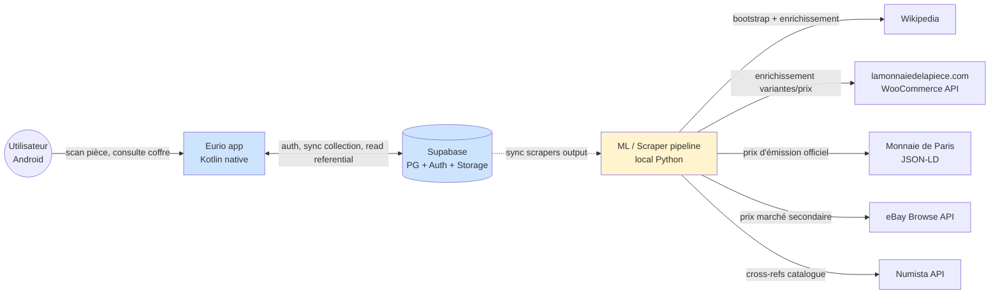
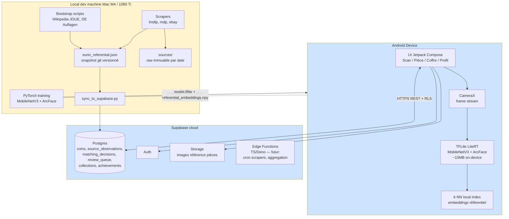
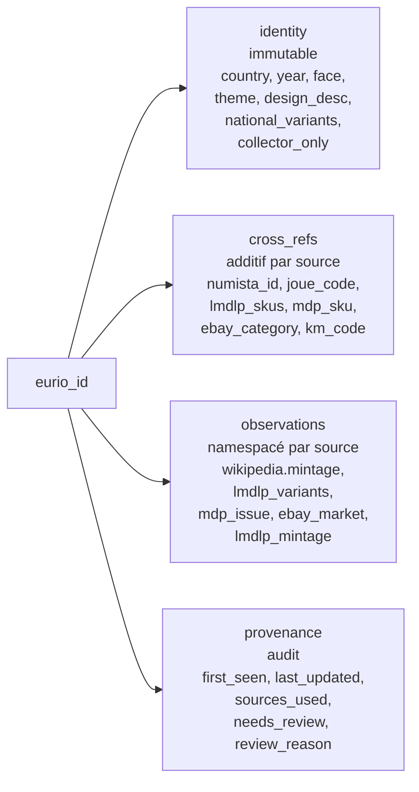
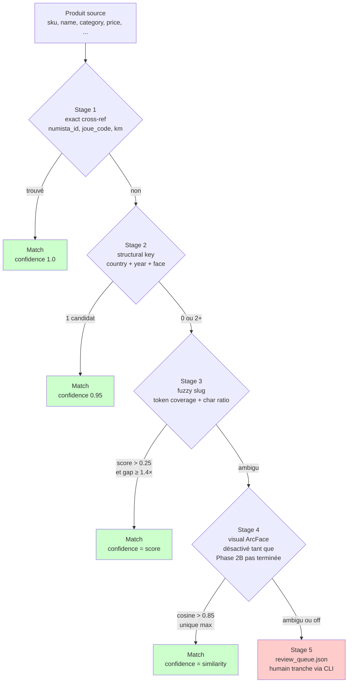
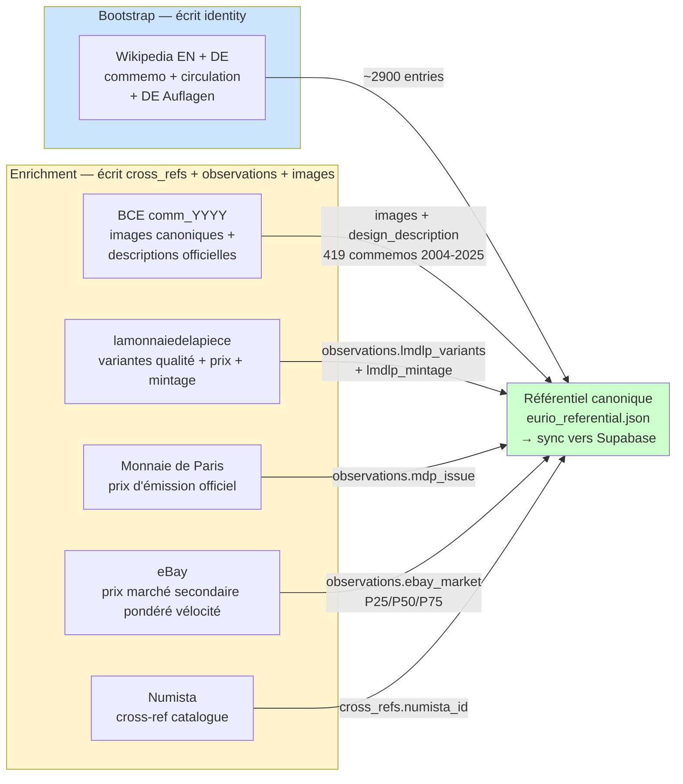
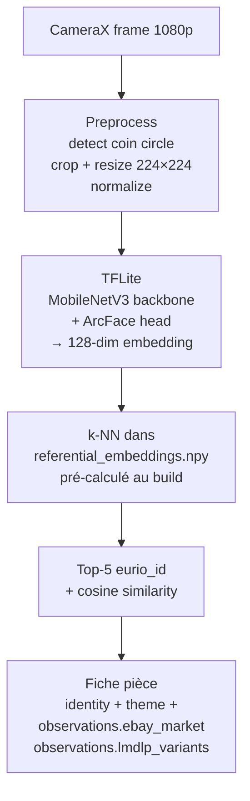
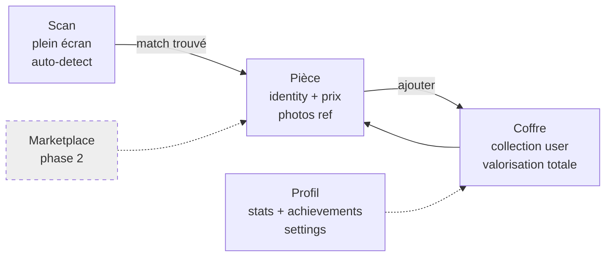
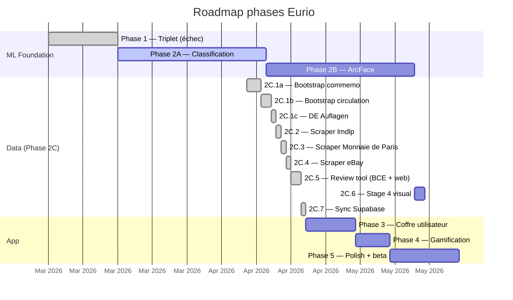

# Eurio — Architecture

> **Statut** : living document, mis à jour par milestone (pas par commit).
> **Dernière mise à jour** : 2026-04-13 (**Phase 2C complète** : bootstrap → scrapers → review tool → Supabase sync).
> **Lecture complémentaire** : [`PRD.md`](../PRD.md) pour les détails produit (sera progressivement absorbé ici), [`docs/research/`](./research/) et [`docs/phases/`](./phases/) comme Architecture Decision Records.

Ce document est volontairement **overview**. Il capture les décisions fondatrices, l'architecture système à gros grain, et l'état courant. Les détails d'implémentation vivent dans les docs de phase et de research.

---

## 1. Vision produit

**Eurio** est l'application mobile Android de référence pour les collectionneurs de pièces euro — du curieux qui trouve une vieille 2€ dans un tiroir au numismate qui complète sa collection depuis 20 ans.

Chaque pièce dans ta poche peut valoir plus que sa valeur faciale. Eurio le dit en quelques secondes, aide à construire une collection, et transforme la chasse aux pièces en une expérience engageante et transparente.

**Trois piliers** :
- **Fluidité absolue** — le scan fonctionne du premier coup, sans manipulation, style QR code
- **Valeur immédiate** — chaque scan révèle une information utile et souvent surprenante
- **Engagement progressif** — de la curiosité au coffre sérieux, avec une boucle de gamification qui donne envie de revenir

**Positionnement** — Eurio occupe un espace vide entre CoinSnap (US, paywall agressif), CoinManager (UI austère), eBay/Catawiki (généraliste, pas d'app), et Numista (web-only, pas de scan). La marketplace Phase 2 crée un fossé concurrentiel durable : une communauté d'acheteurs/vendeurs qui partagent le même référentiel canonique de valeur.

---

## 2. Vue système — C4 niveau 1 (Context)



**Ce qui sort de la vue** : aucun backend custom, aucun VPS, aucune file de messages. Tout passe par Supabase ou s'exécute localement.

---

## 3. Vue containers — C4 niveau 2



**Règles du jeu** :
- L'app Android ne parle **jamais** directement aux scrapers ni aux sources externes. Elle lit uniquement Supabase + des artefacts bundlés (TFLite, embeddings pré-calculés).
- Le référentiel JSON git est la **source de vérité dev-time**. Supabase est une vue matérialisée de ce JSON. Tant que le schema n'est pas figé, on itère sur le JSON.
- Chaque scraper écrit un snapshot daté immuable **avant** de modifier le référentiel, pour que le merge soit reconstructible depuis rien.
- L'entraînement ML est **local** (zéro dépense GPU cloud). Le modèle exporté en TFLite est bundlé dans l'APK.

---

## 4. Principes fondateurs

| # | Principe | Conséquence |
|---|---|---|
| 1 | **Zéro-infra** — pas de VPS, pas de backend custom | Supabase only, Edge Functions pour la logique serveur, cron externe si besoin |
| 2 | **On-device ML** — le scan tourne offline | Pas de coût d'inférence, privacy, résilience réseau |
| 3 | **Référentiel canonique indépendant** — aucune source externe ne peut l'invalider | Bootstrap depuis Wikipedia/JOUE, enrichissement additif, `eurio_id` reconstructible |
| 4 | **Snapshots immuables** — chaque scrape daté, jamais écrasé | Rebuild complet possible depuis `sources/*.json` |
| 5 | **Idempotence partout** — chaque script peut re-run sans corruption | Merge patterns, `replace_review_queue_for_source`, no auto-suffixe |
| 6 | **Dette technique rejetée dès le POC** | Build properly from day 1, pas de shortcuts qui se paient plus tard |
| 7 | **Reproductibilité Nix** — tout dep Python/Android via `flake.nix` + `direnv` | Pas de brew, pas de pip manuel hors venv |
| 8 | **Scan UX = QR scanner** — zéro bouton, continuous auto-scan | Style Yuka / QR code, pas de guides / crop manuel |

---

## 5. Data architecture

### 5.1 Référentiel canonique Eurio

Une entrée = une pièce physique distincte. L'identifiant canonique est reconstructible depuis les attributs structurels :

```
{country_iso2}-{year}-{face_value_code}-{design_slug}

hr-2025-2eur-amphitheatre-pula
fr-2020-50c-standard
eu-2022-2eur-35-years-of-the-erasmus-programme   (émission commune)
de-2013-2eur-50th-anniversary-of-the-signing-of-the-elysee-treaty
```

Format détaillé : voir [`data-referential-architecture.md`](./research/data-referential-architecture.md) §3.

### 5.2 Schema 4 couches

Chaque entrée a 4 couches strictement séparées :



**Invariants** :
- `identity` est immuable une fois écrit. Seul le bootstrap canonique peut la créer.
- `cross_refs` est additif : chaque scraper ajoute son propre ID natif sans toucher ceux des autres.
- `observations` est namespacé par source : chaque scraper a son propre slot, ils ne se marchent jamais dessus.
- `provenance` log tous les sources qui ont touché l'entrée.

### 5.3 Pipeline de matching multi-stage

Quand un scraper trouve un produit, il doit le rattacher à un `eurio_id` canonique. 5 stages avec confidence décroissante :



Spec : [`data-referential-architecture.md`](./research/data-referential-architecture.md) §5.
Évaluation réelle sur lmdlp : [`phase-2c2-lmdlp-run.md`](./research/phase-2c2-lmdlp-run.md).

### 5.4 Sources de données et rôle



**Clé de résilience** : aucune source ne peut invalider le référentiel. Si eBay ferme son API demain, `observations.ebay_market` devient figé mais l'identité des pièces et les autres sources continuent. Si Wikipedia change de format, on fixe le parser et on re-run sur les snapshots immuables. Chaque scraper est un module indépendant.

Détail par source : [`referential-bootstrap-research.md`](./research/referential-bootstrap-research.md), [`ebay-api-strategy.md`](./research/ebay-api-strategy.md), [`euro-ecosystem-map.md`](./research/euro-ecosystem-map.md).

---

## 6. Stack technique

### 6.1 Mobile (Android)

| Couche | Choix | Pourquoi |
|---|---|---|
| Langage | **Kotlin** (pas React Native) | Accès direct TFLite + CameraX, zéro overhead de bridge, react-native-fast-tflite trop fragile |
| UI | **Jetpack Compose** | Déclaratif, stack moderne Android, pas de XML |
| Caméra | **CameraX** | API native Android, frame analyzer stable, fast path vers ImageProxy |
| ML on-device | **LiteRT (ex-TFLite)** natif | Inférence < 500ms sur Pixel 9a, taille < 15MB bundlable dans APK |
| Backend client | **supabase-kt** | SDK officiel Kotlin, RLS transparent, realtime future |
| Cross-platform futur | **Compose Multiplatform** (pour iOS plus tard) | Même codebase Kotlin partagée, pas maintenant |

### 6.2 Backend (Supabase)

| Feature | Usage |
|---|---|
| **Postgres** | 6 tables en place depuis 2C.7 : `coins`, `source_observations`, `matching_decisions`, `review_queue`, `coin_embeddings`, `user_collections` |
| **Auth** | Login email/password, Apple/Google plus tard |
| **Storage** | Images BCE servies directement depuis la source (pas de proxy), Storage réservé à la v2 si on veut cacher |
| **RLS** | Lecture publique (`anon` + `authenticated`) sur les 5 tables référentiel ; `user_collections` owner-only via `(select auth.uid()) = user_id` |
| **Edge Functions** (TS/Deno) | À venir : cron scrapers, aggregation prix, trigger achievements. Types TS auto-générés dans `supabase/types/database.ts`. |
| **Realtime** | Pas prévu v1 (synchro manuelle côté app suffit) |

État après Phase 2C.7 : **2 938** coins, **3 695** observations, **197** items en review queue, **1 771** matching decisions, zéro advisor WARN/ERROR. Free tier 50k rows / 500 MB : usage <10% du quota, marge confortable pour la beta.

### 6.3 ML / data pipeline (local)

| Tool | Usage |
|---|---|
| **Python 3.12 via Nix flake** | Tous les scripts de bootstrap, scrape, training |
| **PyTorch + pytorch-metric-learning** | Entraînement MobileNetV3 + ArcFace sur Mac M4 (MPS) ou 1080 Ti |
| **httpx + beautifulsoup4 + lxml** | Fetch et parsing Wikipedia, lmdlp, mdp |
| **anyascii** | Translittération Grec/Cyrillique/Maltais pour slugify (licence ISC, compatible commercial) |
| **unittest stdlib** | Tests lightweight, pas de pytest |

Pipeline d'entraînement : dataset Numista + augmentation → classification bridge (Phase 2A) → ArcFace avec 500+ classes (Phase 2B) → export TFLite + embeddings référentiel → bundle APK.

### 6.4 Environnement de dev

| Outil | Rôle |
|---|---|
| **Nix flake + direnv** | Toutes les deps (Python, JDK, Android SDK, Kotlin, Gradle, go-task) reproductibles, zéro `brew install` |
| **uv pip** | Gestion venv Python dans le flake |
| **VS Code / Android Studio** | VS Code pour Python et docs, Android Studio pour build release + debug natif |
| **Pixel 9a** | Device de référence pour les tests scan + perf |

Principe : un nouveau dev (ou un nouveau laptop) doit pouvoir run `direnv allow` puis `python ml/bootstrap_referential.py` sans autre setup.

---

## 7. Pipeline ML

### 7.1 Phases

| Phase | État | Contenu |
|---|---|---|
| **Phase 1** — Triplet loss exploration | ✅ échec instructif | Triplet loss sur 500 classes trop bruité, convergence médiocre. Décision : bridge via classification. |
| **Phase 2A** — Classification bridge | 🔄 en cours | Classification fine-tuning de MobileNetV3-Small sur ~500 classes, utilisé comme initialisation pour 2B |
| **Phase 2B** — ArcFace embedding | ⏳ à venir | ArcFace head sur le backbone 2A, embedding 128-dim, k-NN à l'inférence. **Double usage** : scan utilisateur + Stage 4 matching cross-source. |
| **Phase 2C** — Référentiel canonique | ✅ complète | 2 938 entrées (517 commemos + 2 421 circulation), 6 sources (wikipedia, de.wikipedia Auflagen, BCE images, lmdlp, mdp, ebay), pipeline matching 5-stage, review tool web-based avec images, sync Supabase idempotent. Stage 4 visual (2C.6) reste en attente de Phase 2B. |
| **Phase 3** — Coffre utilisateur | ⏳ | Collection personnelle, ajout/retrait de pièces, valorisation totale du coffre. Débloqué par 2C.7. |
| **Phase 4** — Gamification | ⏳ | Achievements, series completion, streak |
| **Phase 5** — Polish + beta | ⏳ | UI finale, onboarding, beta closed puis ouverte |

Détails Phase 1 : [`project_phase1_decisions.md`](../../.claude/projects/-Users-musubi42-Documents-Musubi42-Eurio/memory/project_phase1_decisions.md) (mémoire).

### 7.2 Runtime du scan utilisateur



**Contrainte** : l'index k-NN doit tenir en RAM et fonctionner offline. ~3000 entrées × 128 float32 = 1.5MB, trivial. Embeddings pré-calculés au build (script `ml/precompute_embeddings.py` à venir) et bundlés avec le TFLite.

---

## 8. Frontend — surfaces principales



**Nav principale** : bottom bar 4 items (Scan, Coffre, Profil + Marketplace v2). Scan est l'écran d'entrée par défaut — l'app s'ouvre caméra active.

**Scan UX** : pas de bouton capture, pas de guide visuel compliqué. Continuous frame analysis à ~5 fps, quand la confidence dépasse un seuil → vibration + fiche pièce. Style Yuka / QR code, zéro friction. Détail : [`feedback_scan_ux.md`](../../.claude/projects/-Users-musubi42-Documents-Musubi42-Eurio/memory/feedback_scan_ux.md) (mémoire).

---

## 9. Décisions clés (ADR index)

Ces décisions sont documentées en détail dans leurs propres fichiers. Ce tableau est un index.

| Décision | Quand | Doc de référence |
|---|---|---|
| Kotlin natif plutôt que React Native | Avril 2026 | mémoire `project_eurio_stack.md` |
| Supabase only (pas de VPS) | Avril 2026 | PRD §7, mémoire `project_eurio_stack.md` |
| Triplet loss abandonné → classification bridge → ArcFace | Avril 2026 | mémoire `project_phase1_decisions.md` |
| Scan UX = continuous auto-scan QR-style | Avril 2026 | mémoire `feedback_scan_ux.md` |
| Référentiel canonique indépendant + 5-stage matching | 2026-04-13 | [`data-referential-architecture.md`](./research/data-referential-architecture.md) |
| Option A pour les émissions communes (1 entrée `eu-*` canonique + `national_variants`) | 2026-04-13 | [`data-referential-architecture.md`](./research/data-referential-architecture.md) §3.4 |
| Wikipedia source primaire, BCE validation | 2026-04-13 | [`referential-bootstrap-research.md`](./research/referential-bootstrap-research.md) |
| Slugify via `anyascii` (licence ISC) plutôt que `unidecode` (GPL) | 2026-04-13 | [`phase-2c1-review.md`](./research/phase-2c1-review.md) §3.1 |
| Collision policy permissive (WARN, pas d'exit 1), zéro auto-suffix | 2026-04-13 | [`phase-2c1-review.md`](./research/phase-2c1-review.md) §3.2 |
| DE circulation via `de.wikipedia Auflagen` (source dédiée 2C.1c) | 2026-04-13 | [`phase-2c-referential.md`](./phases/phase-2c-referential.md) §2C.1c |
| eBay Browse API + vélocité (Finding API décommissionnée) | Avril 2026 | [`ebay-api-strategy.md`](./research/ebay-api-strategy.md), mémoire `project_ebay_api_strategy.md` |
| Numista API = catalogue seul, zéro prix | Avril 2026 | mémoire `reference_numista_no_price.md` |
| Matching hybride `max(token_coverage, seq_ratio*0.7)` pour Stage 3 | 2026-04-13 | [`phase-2c2-lmdlp-run.md`](./research/phase-2c2-lmdlp-run.md) §2 |
| `lmdlp_variants` = liste, pas dict | 2026-04-13 | [`phase-2c2-lmdlp-run.md`](./research/phase-2c2-lmdlp-run.md) §5 |
| Tests via stdlib `unittest`, pas de pytest | 2026-04-13 | [`phase-2c1-review.md`](./research/phase-2c1-review.md) §7 |
| `SUBTHEME_COLLAPSE` MDP pour les coincards multi-artwork Louvre | 2026-04-13 | [`phase-2c3-mdp-run.md`](./research/phase-2c3-mdp-run.md) §4 |
| eBay queries larges (pays+année seuls) + filtre theme post-fetch | 2026-04-13 | [`phase-2c4-ebay-run.md`](./research/phase-2c4-ebay-run.md) §1 |
| Velocity-weighted `listing_weight = log1p(sales_per_year) × seller_trust` | 2026-04-13 | [`phase-2c4-ebay-run.md`](./research/phase-2c4-ebay-run.md) §4 |
| BCE `comm_YYYY.en.html` source primaire d'images canoniques (Wikipedia n'en a pas) | 2026-04-13 | [`phase-2c5-review-tool-run.md`](./research/phase-2c5-review-tool-run.md) §2 |
| Review tool = web server local stdlib (pas CLI), images side-by-side, raccourcis clavier | 2026-04-13 | [`phase-2c5-review-tool-run.md`](./research/phase-2c5-review-tool-run.md) §5 |
| Rejet au scrape time : `^N x 2 euros` (N≥2) + ` + ` (bundles de thèmes distincts) | 2026-04-13 | `ml/scrape_lmdlp.py` `is_single_commemo` |
| Bootstrap merge doit préserver `images`, `design_description`, `sources_used` sur re-run | 2026-04-13 | [`phase-2c7-supabase-sync-run.md`](./research/phase-2c7-supabase-sync-run.md) §3 |
| Postgres `NULLS NOT DISTINCT` sur `source_observations` unique constraint | 2026-04-13 | [`phase-2c7-supabase-sync-run.md`](./research/phase-2c7-supabase-sync-run.md) §2 |
| RLS lecture publique sur référentiel, owner-only sur `user_collections` via `(select auth.uid())` | 2026-04-13 | [`phase-2c7-supabase-sync-run.md`](./research/phase-2c7-supabase-sync-run.md) §2 |

La convention : quand une décision non-triviale est prise, elle doit avoir un doc de référence quelque part (phase, research, run report, ou mémoire). Cette table est juste l'index.

---

## 10. État courant (2026-04-13)



### Jalons Phase 2C franchis

| Sous-phase | Résultat |
|---|---|
| **2C.1a/b/c Bootstrap** | 2 938 entrées propres (517 commémoratives + 2 421 circulation dont 122 DE complètes avec détail par mint A/D/F/G/J) |
| **2C.2 lmdlp** | 73% match auto (162 Stage 2 + 390 Stage 3 sur 760 produits), 268 entrées enrichies avec variantes + mintage |
| **2C.3 Monnaie de Paris** | **100% match**, 17 produits, 5 entrées enrichies avec prix d'émission officiel (BU + BE) |
| **2C.4 eBay** | 30 pièces enrichies avec P25/P50/P75 pondéré velocity, 30 API calls, P50 médian 5.90€, Astérix FR 2019 détecté à 65€ |
| **2C.5 Review tool** | Web server stdlib avec images BCE side-by-side ; 419 commemos avec images canoniques (81%) ; bundles/multipacks filtrés au scrape time |
| **2C.7 Sync Supabase** | 6 tables canoniques live, RLS configurée, 0 advisor WARN ; script idempotent, 2ème run = mêmes counts exacts |

**État cumulatif** : 2 938 coins, 3 695 observations, 419 avec images, 197 items en review queue, 1 771 décisions de matching dans la DB. **83 tests unitaires verts**.

**Ce que ça débloque** : Phase 3 (coffre Android) peut démarrer — le référentiel est production-ready, la jointure `coins → source_observations` se fait en 1 round-trip PostgREST, les types TypeScript sont prêts pour Edge Functions.

**Ce qui reste en 2C** :
- **2C.6 Stage 4 visual** : bloqué par Phase 2B (ArcFace). Réduirait les escalades FR↔EN restantes.
- **Review manuelle** : 121 groupes uniques dans la queue, ~20 min dans le web tool si le user veut.
- **Cron sync** : l'exécution Edge Function pour le refresh hebdo des sources — attend Phase 3 ou plus tard.

### Prochaines options

- **A.** Phase 2B ArcFace (training + export TFLite) — débloque le scan utilisateur ET le Stage 4 visual
- **B.** Phase 3 coffre (écrans Kotlin + branchement Supabase) — peut avancer en parallèle de 2B
- **C.** Review manuelle de la queue (121 groupes, ~20 min web tool)

---

## 11. Changelog

> Ce changelog trace les milestones majeurs du doc — pas chaque modif. Une entrée par grosse avancée ou changement architectural.

### 2026-04-13 (initial write)
- Création du doc.
- Absorbe vision PRD §1-2, stack PRD §7-8.
- Intègre toutes les décisions de Phase 2C.1 (review) et 2C.2 (lmdlp run).
- Référentiel à 2 938 entrées, 73% match auto lmdlp, 48 tests verts.
- Gantt roadmap Phase 1 → Phase 5 établie.

### 2026-04-13 (Phase 2C complète)
- **Phase 2C entièrement livrée** (hors 2C.6 Stage 4 visual bloqué par 2B) en une journée.
- Ajout sources : MDP (2C.3, 100% match), eBay (2C.4, 30 coins P25/P50/P75), BCE images (2C.5b, 419 commemos), `scrape_bce_images.py` en primary image source.
- Review tool refait en **web server local** avec images side-by-side : `ml/review_core.py` (pure helpers) + `ml/review_queue_server.py` (stdlib http.server, dark theme, keyboard shortcuts). Ancien `review_queue.py` CLI **supprimé**.
- Filtres scrape étendus : rejet des bundles `N x 2 euros` et séparateurs `+` pour éviter de polluer le référentiel avec des coincards multi-pièces. Eurio cible des pièces individuelles uniquement.
- Matching module factorisé dans `ml/matching.py`, partagé par lmdlp + mdp + ebay (+ bce).
- **Supabase schema canonique en place** : drop du legacy Numista-centric, création des 6 tables avec RLS et contraintes `NULLS NOT DISTINCT`, sync Python idempotent via PostgREST batch upsert. Types TypeScript auto-générés dans `supabase/types/database.ts`.
- Bug critique corrigé : les 3 scripts `bootstrap_*.py` ne préservaient pas `images` et `design_description` dans leur merge pattern de re-run, wipeant silencieusement les enrichments BCE. Fix appliqué.
- **83 tests unitaires verts** (29 → 48 → 59 → 73 → 79 → 83 au fil des phases).
- ADR index enrichi de 10 décisions supplémentaires (§9).

**Datum référentiel** : 2 938 coins · 3 695 observations · 419 avec images · 197 review · 1 771 decisions · 0 advisor WARN.
