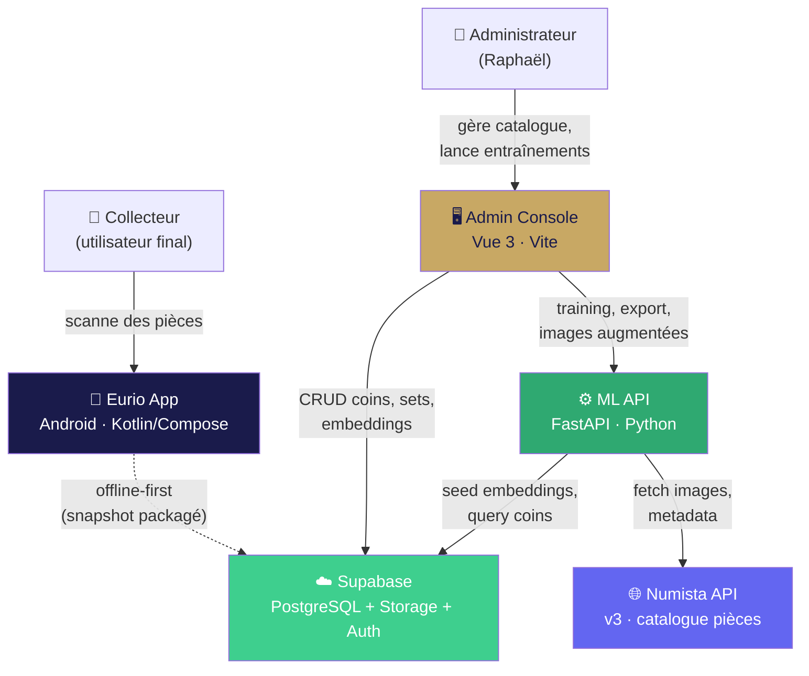
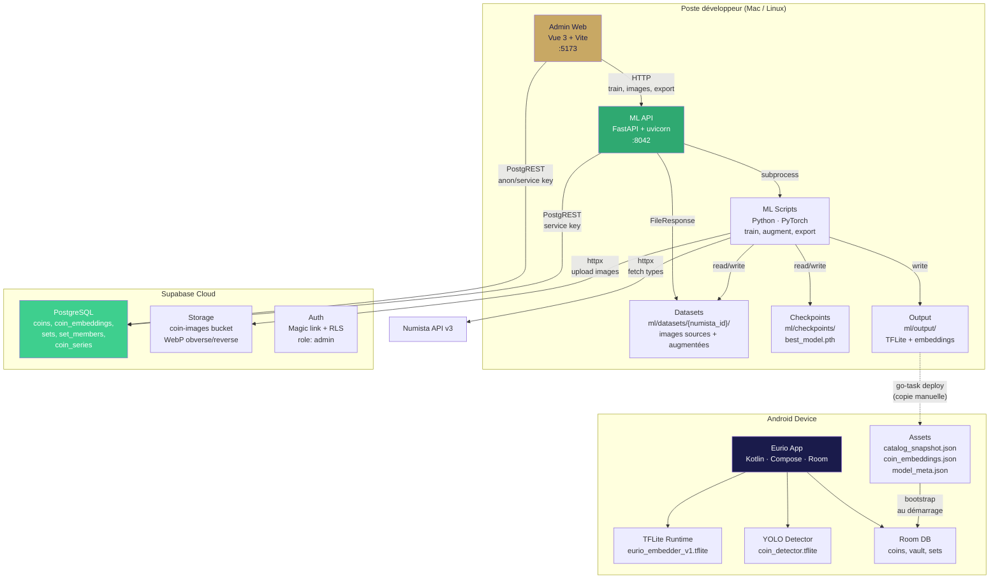
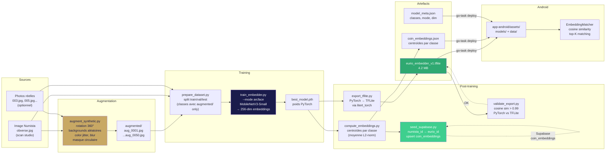
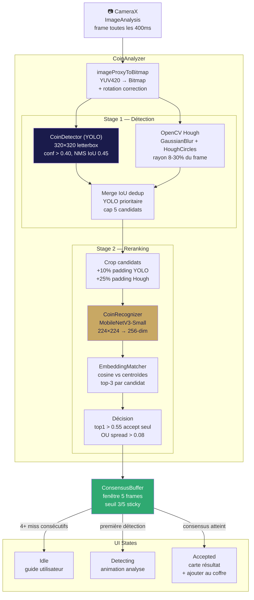
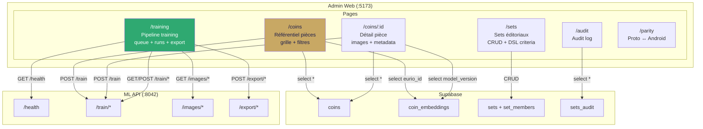
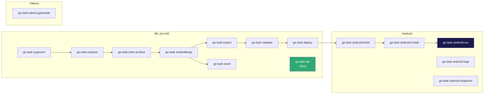
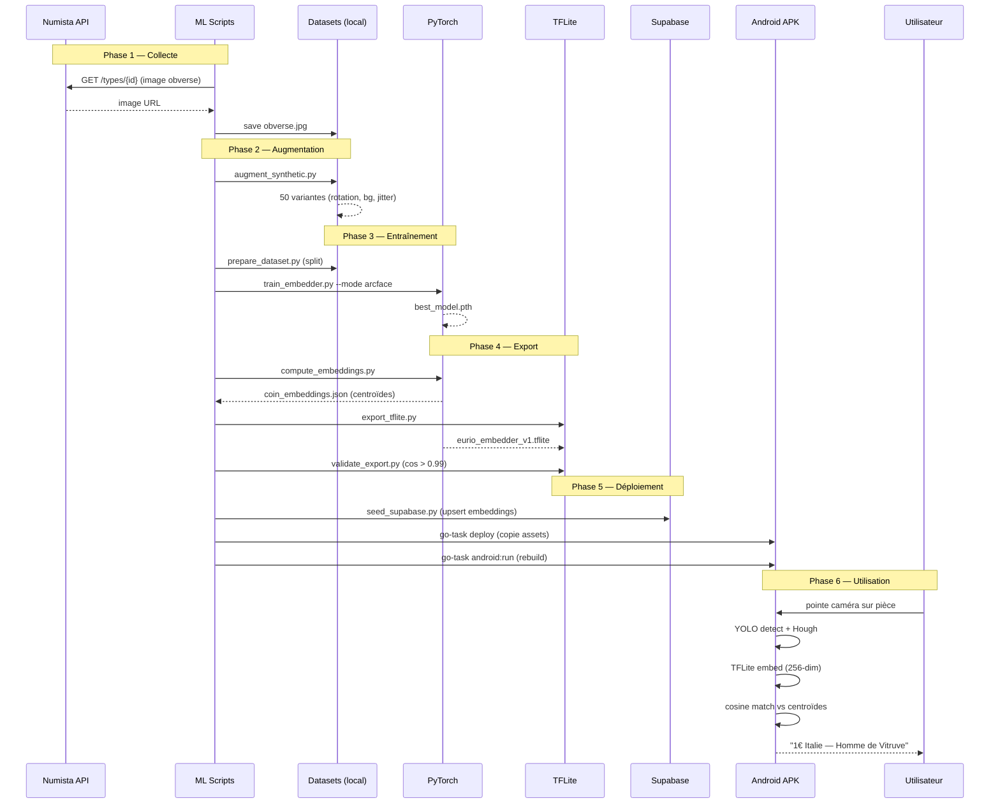

# Architecture C4 — Eurio

> Diagrammes d'architecture au format Mermaid. Niveaux : System Context, Container, Component.

## 1. System Context

Vue d'ensemble : qui interagit avec quoi.

## 2. Container Diagram

Les briques techniques et leurs connexions.

## 3. Component — Pipeline ML

Le flux de données du training jusqu'au déploiement Android.

## 4. Component — Scan Pipeline (Android)

Ce qui se passe quand l'utilisateur pointe sa caméra sur une pièce.

## 5. Component — Admin Console

Les pages et leurs sources de données.

## 6. Deployment — Commandes go-task

## 7. Data Flow — Du scan Numista au scan utilisateur

