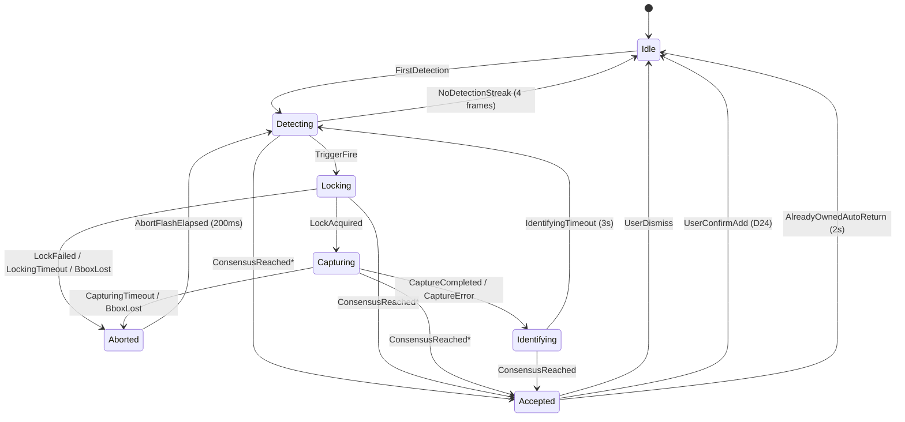

# Vision — best-frame capture

> Cible end-state, principes, scope V1, anti-objectifs.
> Doit être lu avant tout chunk d'implémentation dans ce dossier.

## 1. Scénario d'usage (1 phrase)

L'utilisateur ouvre l'app, pointe la caméra sur une pièce qu'il tient en
main ; tant qu'il bouge ou cherche, le scan continue silencieusement ;
dès que la pièce reste stable et identifiable, l'app verrouille
focus/exposition/balance des blancs, capture une rafale courte, en garde
la meilleure frame, lance la reconnaissance ArcFace dessus, montre la
fiche pièce, et stocke en parallèle une version haute-qualité de cette
frame dans le coffre comme « la photo de **sa** pièce ».

## 2. Problème

Aujourd'hui (cf. `app-android/.../features/scan/ScanScreen.kt` +
`CoinAnalyzer.kt` + `SnapNormalizer.kt`) :

| Aspect | État | Limite |
|---|---|---|
| Frame rate analyzer | ~2.5 fps (400ms) | OK |
| Détection | YOLO + Hough merge IoU>0.6, top-5 | OK |
| Normalisation crop | Bit-for-bit Python (Hough → mask → 224) | OK |
| Reco | ArcFace 256d + k-NN cosine | OK |
| Consensus | Ring 5/3 sticky | OK pour décider quoi afficher |
| **Best-frame selection** | **Inexistant** | Toutes les frames passent à l'égal |
| **AE/AF/AWB lock** | **Inexistant** | Caméra continue à hunter pendant la reco |
| **Capture full-sensor** | **Inexistant** | YUV preview compressé pour tout |
| **Archive user** | **Inexistant** | Aucune frame ne reste après la fiche |

Conséquences :
- L'utilisateur ne garde aucune trace de **sa** pièce — le coffre affiche
  les photos Numista canoniques, jamais sa prise réelle.
- L'inférence tourne sur des frames floues/mal-exposées qui auraient pu
  être rejetées en amont — on dépend du modèle pour rattraper ce qu'un
  filtre qualité bête aurait éliminé.
- Préparer la **phase marketplace future** (Référentiel V2 phase 4,
  cf. `docs/research/referential-v2.md` — distincte de la Phase 4
  app-implem qui est la carte eurozone) est impossible sans bibliothèque
  de captures réelles par pièce possédée.

## 3. Cible end-state

**Cinq composants nouveaux, une refonte du schéma vault, zéro nouveau modèle ML.**

| Composant | Rôle |
|---|---|
| **FrameQualityScorer** | Score agrégé sharpness × exposure × completeness par frame, sur le crop normalisé 224 |
| **TriggerStrategy** | Decide quand basculer Detecting → Locking (3 candidats interchangeables) |
| **CameraLockController** | Wrap Camera2Interop pour locks AE/AF/AWB déclenchés/relâchés sur transitions state |
| **VaultCaptureRepository** | Écrit Room + filesystem, expose `archive(...)` (capture auto, journal) et `confirmPossession(...)` (tap user, coffre) |
| **DebugBar (BuildConfig.DEBUG)** | Sliders/toggles temps réel + HUD overlay |

### Rapport à l'existant

| Existant | Devenir |
|---|---|
| `vault_entries` (table journal scan/manual_add) | Migré vers `coin_in_vault` (1 row/eurio_id) + `coin_captures` (journal). Migration `MIGRATION_2_3` documentée dans chunk-5 §Migration. `vault_entries` est DROP en fin de migration. |
| `ScanViewModel.onAddToVault()` (bouton « Ajouter au coffre » sur AcceptedCard) | **Préservé**. Continue à acter la possession (`coin_in_vault` upsert) sur tap user, cohérent avec décision #7 phase-1 app. Les `coin_captures` s'archivent en background indépendamment du tap (P1) — y compris si l'utilisateur dismiss sans ajouter (orphelins tolérés, cf. D24). |
| `photoMode` (debug snap manuel → `<extDir>/eurio_debug/snaps/snap_<ts>/`) | Conservé tel quel — outillage ArcFace debug. N'écrit jamais dans `filesDir/vault/`. Stockage externe vs interne, zéro overlap. |
| `captureMode` + `CaptureProtocol` (Phase 0 golden-set → `<extDir>/eurio_debug/eval_real/<eurioId>/`) | Conservé — protocole ML training, distinct du vault user. Stockage externe vs interne, zéro overlap. |
| `vault_entries.source = MANUAL_ADD` | Représenté dans le nouveau schéma comme `coin_in_vault` avec `primaryCaptureId = null` (pas de capture associée). Le rendu fiche coffre fallback sur l'image canonique Numista quand `primaryCaptureId == null`. |

Le pipeline scan évolue de :

```
[continuous] frame → detect → normalize → ArcFace → consensus → fiche
```

À :

```
[continuous]   frame → detect → normalize → ArcFace → consensus ─┬─> fiche (immediate)
                                                                 │
[trigger-aware] └─> rolling buffer (N=5 frames + scores)          │
                       │                                          │
                       ↓ (trigger fires)                          │
[locking]         AE/AF/AWB lock                                  │
[capturing]       burst preview (re-score) + ImageCapture full ───┴─> coffre archive
```

**Deux flux découplés** : le flux *reconnaissance* (rapide, basse latence,
sur preview) reste maître du timing fiche. Le flux *archivage* (lent,
haute qualité, full-sensor) tourne en parallèle et ne bloque rien.

## 4. Architecture cible

### State machine (6 états + 1 transient)



\* `ConsensusReached` peut fire depuis n'importe quel état entre
`Detecting` et `Identifying` → bascule immédiate vers `Accepted`, lock
libéré async (cf. P1 vision.md + D3 decisions.md). Le détail des
transitions, des side effects et des timeouts est dans chunk-6.

### Composants

```
┌─ ScanViewModel ─────────────────────────────────────────────────┐
│   reducer : (ScanState, ScanEvent) -> ScanState                 │
└──────────────────────────────────────┬──────────────────────────┘
                                       │
        ┌──────────────────────────────┼────────────────────────┐
        │                              │                        │
   CoinAnalyzer              TriggerStrategy            CameraLockController
   (existing)                (box_stab/yolo_conf       (Camera2Interop)
        │                     /arcface_csns)                    │
        │                              │                        │
   FrameQualityScorer ────> RollingFrameBuffer (N=5)             │
        │                              │                        │
        │                              ↓                         │
        │                       BestFrameSelector                │
        │                              │                        │
        │                              ↓                         │
        │                       VaultCaptureRepository ──┐       │
        │                       (Room + filesystem)      │       │
        │                                                ↓       │
        │                                          ImageCapture ─┘
        │                                          (full-res JPEG)
        │
   DebugBar (overlay, BuildConfig.DEBUG only)
   ├─ Trigger mode radio
   ├─ Sliders params
   ├─ Quality gates sliders
   ├─ HUD live (state, scores, timing)
   └─ Replay last buffer
```

## 5. Principes non négociables

### P1 — Reconnaissance et archivage découplés

Le flux **reconnaissance** ne dépend jamais du flux **archivage**. La
fiche s'affiche dès que ArcFace consensus est atteint, indépendamment de
l'état du burst ou du `ImageCapture`. Inversement, si l'archive échoue
(quality gates non passées, `takePicture` timeout), la fiche reste
visible, et un état dégradé est noté dans `coin_captures.capture_metadata`
sans pop-up bloquant.

### P2 — Rolling buffer pré-trigger

Le buffer ring (N=5 frames) tourne en continu dès l'entrée en Detecting.
Quand le trigger fire, on a déjà 5 frames scorées sous la main → on
sélectionne la meilleure rétroactivement, on ne re-burst que si aucune ne
passe les seuils absolus. Gain perçu : 1-2 secondes par scan réussi.

### P3 — Trigger interchangeable, jamais figé, jamais auto-supprimé

Les trois stratégies (`box_stability`, `yolo_confidence`,
`arcface_consensus`) sont implémentées en parallèle, sélectionnées au
runtime via la debug-bar (debug build) ou via un setting interne
(release). Le choix par défaut sera tranché après bench device, **pas
a priori**. Même après bench, aucune stratégie n'est supprimée
automatiquement : la décision de retirer un path de détection se prend
conjointement (user + audit), pas en code-mort silencieux. Toutes les
stratégies restent compilées en release jusqu'à preuve qu'une est
inutile.

### P4 — Possession ≠ Capture

Le schéma DB sépare strictement :
- `coin_in_vault` : 1 row par eurio_id possédé (granularité collection)
- `coin_captures` : N rows par eurio_id (journal historique des prises)

Le scan n'essaie **jamais** d'inférer si "c'est le même exemplaire
physique" — l'embedding ArcFace n'est pas fiable à ce niveau. Chaque
scan archive dans `coin_captures` ; aucun n'incrémente automatiquement le
`declared_count` du coffre. L'utilisateur déclare manuellement s'il a
plusieurs exemplaires (UI fiche coffre, plus tard).

### P5 — EXIF absent par construction

Aucune image écrite sur disque ne contient EXIF (geo, sensor params,
timestamp caméra). En chemin nominal, le re-encodage
`Bitmap.compress(JPEG, …)` du `JpegPipeline` ne propage pas l'EXIF
source — donc le strip est implicite, gratuit. `ExifStripper` est
conservé comme garde-fou explicite, appelé uniquement sur les chemins
qui passent des `ByteArray` JPEG bruts (ex: import d'une photo galerie,
post-v1). Permet une éventuelle sync Supabase Storage future sans
risque de fuite PII rétroactive.

### P6 — Debug-bar = uniquement BuildConfig.DEBUG

La debug-bar n'existe pas dans le build release. Pas de toggle caché, pas
de feature flag, pas de "long-press 5 fois pour activer". Si on veut
bench en pre-prod, on shippe un APK debug-build dédié. Cf.
`feedback_no_debt`.

### P7 — Tout est traçable pour le replay

Chaque entrée de `coin_captures` contient le mode trigger actif, les
paramètres effectifs, et les scores qualité de la frame retenue + des
frames du buffer rejetées (en JSON). On peut, plus tard, replay une
décision avec d'autres paramètres sur les frames historiquement
bufferisées (chunk 7).

### P8 — Forward-compat marketplace sans dette technique

La sync marketplace (vente / échange P2P avec grading déclaré, prix,
historique) est explicitement post-v1 — cf. roadmap Référentiel V2
phase 4 dans `docs/research/referential-v2.md`. **On ne la build pas**.
Mais on ne *bloque* pas son arrivée par des choix qui forceraient une
refonte schéma plus tard :

- `coin_captures.captureMetadataJson` est versionné (`schemaVersion: Int`)
  et conçu pour être uploadable tel quel — pas d'opaque binary, pas de
  référence locale Room, pas de chemin filesystem.
- `CoinInVaultEntity` et `CoinCaptureEntity` portent des champs nullables
  `uploadedAt: Long?` et `remoteVaultId: String?` réservés à la sync
  future (occupent ~16 octets/row, coût ignorable).
- Aucun EXIF (cf. P5), aucun chemin local dans le JSON
  (uniquement le `captureId` uuid v4, le `imageFilename` étant
  `<captureId>.jpg` — re-buildable côté serveur).
- Aucune contrainte de cohérence « instance physique unique » —
  `eurio_id` est la clé de jointure, l'instance reste implicite (P4).

**En contrepartie : rien d'autre n'est ajouté pour la sync.** Pas de
queue, pas de service worker, pas d'API client, pas de feature flag,
pas de pattern Repository « offline first » premature. Le jour où on
build la sync, on ajoute un module dédié qui lit ces champs — pas de
migration nécessaire, pas de dette créée pour un usage futur incertain
(cf. `feedback_no_debt`).

## 6. Anti-objectifs v1

- ❌ Détection instance-level visuel ("est-ce ma même pièce qu'hier ?").
  Pas fiable. L'utilisateur déclare manuellement.
- ❌ Multi-instances créées automatiquement au re-scan. On archive en
  journal, point.
- ❌ Grading qualité **automatique inféré par ML** (UNC/TTB/TB ou
  Belle/TB/SUP/SPL ou Sheldon 70 points). Pas de modèle ML pour ça en
  v1. À distinguer du grading **déclaré par l'utilisateur** dans le
  futur marketplace P2P (Référentiel V2 D3), qui lui ne touche pas le
  pipeline scan.
- ❌ Sync Supabase Storage des images utilisateur. Local-only v1, sync
  arrivera avec la phase marketplace future (Référentiel V2 phase 4).
  Le schéma est forward-compat (P8) mais la sync elle-même est
  out-of-scope, y compris la queue, le retry, le conflict-resolution.
- ❌ Burst hardware multi-frames RAW. On capture une seule full-res JPEG
  via `ImageCapture` ; le "burst" du scoring se fait sur la preview YUV
  qui tourne déjà.
- ❌ Super-resolution / multi-frame fusion. Idée intéressante mais on
  attend que la simple sélection prouve ses limites avant.
- ❌ Toggle user-facing pour activer/désactiver le best-frame mode. C'est
  le mode par défaut une fois shippé, ou ça ne ship pas.
- ❌ Stockage de frames pour pièces non-reconnues. Si ArcFace top1<0.20
  on n'archive pas — sinon coffre rempli de pièces fantômes.

## 7. Décisions actées

Voir [`decisions.md`](decisions.md) pour la liste numérotée des
17 décisions tranchées avec leur rationale et leurs alternatives
rejetées.

## 8. Décisions à confirmer empiriquement

1. **Stratégie de trigger gagnante** : à trancher après bench device
   (chunk 7). Hypothèse de travail : `box_stability` (IoU>0.7 sur 3
   frames), mais sans engagement.
2. **`ImageCapture` + `ImageAnalysis` simultanés sur Pixel 9a et
   mid-range Samsung** : à valider techniquement avant de figer l'archi
   (chunk 5). Si non-supporté, fallback "best preview YUV → encode JPEG".
3. **Burst size optimal** : 5 frames est l'hypothèse, à vérifier sur 50
   captures bench réelles.
4. **Quality gate thresholds absolus** (Laplacian variance, exposure
   range, completeness margin) : calibrés sur ~50 captures dans le bench
   du chunk 7.

## 9. Ce qui peut faire pivoter le plan

1. **`ImageCapture` incompatible avec `ImageAnalysis` simultané** sur
   devices cibles → on passe à "best preview YUV ré-encodé en JPEG".
   Perte qualité acceptable mais visible en zoom.
2. **Bench montre qu'aucun des 3 triggers ne tient < 2.5 s end-to-end**
   → on tente le déclenchement "ArcFace consensus déjà atteint" + burst
   *rétroactif* sur le rolling buffer uniquement (pas de burst nouveau),
   donc latence ≈ identique à aujourd'hui mais qualité meilleure.
3. **Utilisateurs rapportent une coupure UX du lock AE/AF** (effet
   "freeze" perçu malgré le découplage) → on relâche le lock plus tôt
   (dès consensus, pas dès Accepted).

## 10. Glossaire

| Terme | Définition |
|---|---|
| **Best-frame** | Frame du rolling buffer avec le score qualité agrégé le plus haut |
| **Rolling buffer** | Ring de N=5 frames preview avec scores, mis à jour à chaque tick analyzer |
| **Trigger** | Heuristique qui décide quand passer Detecting → Locking |
| **Quality score** | Somme pondérée de sharpness + exposure + completeness (+ motion) |
| **Quality gate** | Seuil absolu sur le score qui qualifie une frame de "good enough" |
| **AE/AF/AWB lock** | Verrouillage exposition + autofocus + balance des blancs via Camera2Interop |
| **Aborted** | État transient (200 ms) avant retour Detecting, déclenché par LockFailed / LockingTimeout / CapturingTimeout / BboxLost. Visualisé par un flash rouge sur le debug overlay (chunk-4 D21). Invisible en release. |
| **Archive** | Persistance Room + filesystem JPEG haute-qualité dans le vault utilisateur (`filesDir/vault/<captureId>.jpg`) — **distinct du « capture mode » debug** (Phase 0 golden-set qui écrit dans `externalFilesDir/eurio_debug/eval_real/`) |
| **Capture journal** | `coin_captures`, toutes les captures historiques par `eurio_id`. Une row par scan accepté, indépendamment du tap « Ajouter au coffre » (P1 + D24) — **distinct du « capture mode » debug** qui sert au protocole ML training |
| **Possession** | `coin_in_vault`, granularité 1 row par `eurio_id` collecté. Créée uniquement sur tap explicite « Ajouter au coffre » (cohérent avec décision #7 phase-1 app) |
| **Replay** | Re-jouer la décision best-frame à froid sur des frames bufferisées avec d'autres paramètres |
